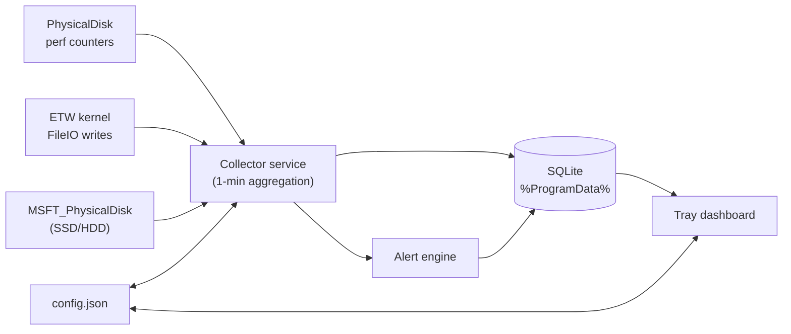

# Disk Activity Monitor

A lightweight Windows tool that tracks how much data is **written to and read from your
drives over time**, so you can spot processes that hammer an SSD and protect its limited
write endurance. It focuses on **aggregate trends** (MB/GB per hour, day and week) rather
than noisy instantaneous values.

It has two parts:

| Component | What it does |
|-----------|--------------|
| **Collector service** (`DiskActivityMonitor.Service`) | A background worker that samples Windows performance counters, aggregates them into one-minute buckets, stores them in a small SQLite database, and raises alerts. Runs as a Windows Service (or a console app). |
| **Tray app** (`DiskActivityMonitor.Tray`) | A system-tray dashboard (WPF) that visualizes the collected trends, ranks the noisiest processes, shows alerts, and lets you tune thresholds. |

Both share a database under `%ProgramData%\DiskActivityMonitor\`.

---

## Why this exists

Consumer SSDs are rated for a finite **TBW** (terabytes written). A misbehaving app that
writes continuously can chew through that budget far faster than normal use. This tool makes
that visible: it answers *"how much am I writing per day, and what is responsible?"* and
warns you when a drive or process crosses a threshold you set.

---

## Features

- **Per-disk write/read trends** charted per **hour (24h)**, **day (30d)**, and **week (12w)**.
- **Automatic SSD vs HDD detection** via the Windows Storage WMI provider, so endurance
  features apply to solid-state drives.
- **Top writing processes** over a selectable window (last minute through past year), via the
  ETW kernel `FileIO` provider, to pinpoint culprits.
- **Auto-suspend rules** that freeze a process when its rolling-hour writes exceed a limit -
  either after a one-click toast confirmation (the default) or automatically.
- **SSD endurance projection** — enter a drive's TBW rating and it estimates years-to-TBW at
  your current write rate and the percentage observed since monitoring began.
- **Rolling-window alerts** for high SSD writes (per hour / per day) and heavy single
  processes, with configurable thresholds and a cooldown to avoid spam.
- **Tray icon status color** (green / amber / red) reflecting the worst outstanding alert,
  plus optional desktop balloon notifications.
- **Tunable settings** edited live from the dashboard; the collector picks up changes
  automatically.
- **Self-contained data** in `%ProgramData%\DiskActivityMonitor\` (SQLite, WAL mode) with
  automatic pruning after a configurable retention period.

---

## Requirements

- Windows 10/11
- .NET 10 SDK (or the .NET 10 Desktop Runtime to run published binaries)
- [Inno Setup 6](https://jrsoftware.org/isinfo.php) (only needed to build the installer)

---

## Quick start (development, no admin)

```powershell
# From the repo root — builds, then launches the collector + dashboard:
.\run.ps1

# Or force a rebuild first:
.\run.ps1 -Build

# Or use the scripts\run-dev.ps1 helper that launches both in separate windows:
.\scripts\run-dev.ps1
```

This builds everything, starts the collector in one window, and opens the dashboard. Give the
collector a couple of minutes so the per-minute buckets accumulate; charts fill in as history
grows.

## Install as a Windows Service (recommended)

Run an **elevated** PowerShell:

```powershell
.\scripts\install.ps1
```

This:
1. Publishes the service and tray app to `.\publish\`.
2. Installs and starts the **DiskActivityMonitor** Windows service (auto-start at boot).
3. Adds a Startup shortcut so the tray app launches at logon.
4. Launches the tray app immediately.

To remove it (elevated):

```powershell
.\scripts\uninstall.ps1
```

Collected history and settings are left in `%ProgramData%\DiskActivityMonitor\`; delete that
folder if you also want to discard the data.

---

## Using the dashboard

- **Disk selector** (top right): SSDs are listed first and tagged. Trends and endurance apply
  to the selected disk.
- **Summary cards**: written today, last 24h, last 7 days, and an endurance/projection card.
- **Trend chart**: toggle **24h / 30d / 12w**. Bars are bytes written to the device in each
  bucket; the current bucket is highlighted.
- **Top writing processes**: I/O write bytes over the last 24h (a close upper-bound proxy for
  disk writes).
- **Recent alerts**: a rolling one-hour log of fired alerts that auto-age out. The tray icon
  color resets to green when no alerts remain in the window.
- **Settings**: thresholds (in GB), sample interval, desktop notifications, and the selected
  drive's **TBW rating** (TB). Click **Save settings**; the collector applies them live.

The tray icon's right-click menu offers *Open dashboard*,
*Open data folder*, and *Exit*. Closing the dashboard window hides it to the tray; use *Exit*
to quit the app.

### Auto-suspending heavy writers

The **Auto-suspend rules** card lets you stop a runaway writer before it wears the disk:

- **Add a rule** for a process already seen by the monitor (pick it from the dropdown) or
  **Browse for an `.exe`** on disk for one that hasn't been seen yet - the rule matches the
  executable's image name.
- Set a **limit** in GB written per rolling hour. When a process exceeds it, the app reacts.
- Each rule is either **confirm** (a toast asks before suspending - the default for every new
  rule) or **Auto** (suspend immediately, then notify with a *Resume* button).
- Suspended processes appear under **Currently suspended** with a **Resume** button, and the
  auto-suspend toasts carry *Suspend now* / *Resume* actions.

Suspending freezes every thread in the target. The dashboard runs in your user session, so it
can suspend your own processes; suspending an elevated/other-user process requires the app to
run elevated and otherwise reports “access denied”.

---

## Command-line interface (`dam`)

A full CLI (`dam.exe`) reads and writes the same database and `config.json` as the service and
tray, so you can inspect activity, manage alerts/snoozes, and change settings from a terminal.

```powershell
# From the repo root (builds on first run):
.\dam.ps1 status
.\dam.ps1 top --minutes 30 --count 15

# Or run the built exe directly:
src\DiskActivityMonitor.Cli\bin\Debug\net10.0-windows\dam.exe status
```

| Command | What it does |
|---------|--------------|
| `status` | Service/DB status, disk count, unacked alerts, snoozes |
| `disks` | List monitored disks (media, size, SMART wear) |
| `summary [--disk ID] [--all]` | Writes today / last 24h / last 7d |
| `top [--minutes N] [--count N]` | Top processes by writes in a window (default 60m, 10) |
| `process <name>` | Writes for a process across 1m/5m/15m/30m/1h/24h |
| `trends [--range hour\|day\|week] [--count N] [--disk ID]` | Write trend with bar chart |
| `endurance [--disk ID] [--all]` | SSD TBW usage, SMART wear, projection |
| `watch [--interval N]` | Live auto-refreshing dashboard (Ctrl+C to exit) |
| `alerts [--all] [--count N] [--full]` | List alerts (unacknowledged by default) |
| `ack <id>... ` / `ack --all` | Acknowledge alerts |
| `snooze list` | Show active snoozes |
| `snooze process <name> <dur>` | Snooze a process (e.g. `30m`, `1h`, `1d`, `1w`) |
| `snooze all <dur>` | Snooze every alert for a duration |
| `snooze clear <name>\|--global\|--all` | Clear snoozes |
| `config get [key]` | Print all config, or one key |
| `config set <key> <value>` | Change a threshold/setting (the service reloads live) |
| `help` / `version` | Usage / version |

---

## How it works



- **Disk volume** is read from the `PhysicalDisk\Disk Read/Write Bytes/sec` counters and
  integrated over each sampling interval. These reflect bytes that actually reached the
  device, which is what matters for SSD wear.
- **Per-process** numbers come from the Windows kernel ETW `FileIO` provider: the byte size of
  every file read/write is attributed to the process that issued it, aggregated by process
  name. Because only genuine file-system writes raise these events, named-pipe, device-ioctl
  and other non-disk I/O are excluded — so a process stuck in an IPC/UI loop no longer shows up
  as a heavy disk writer. The ETW session needs elevation; the collector runs as LocalSystem.
  When ETW is unavailable (e.g. run un-elevated during development) it falls back to cumulative
  `GetProcessIoCounters` deltas, which are an *upper bound* that mixes file, pipe and device I/O.
- Samples are aggregated into **one-minute buckets** and rolled up to hour/day/week for
  charting in local time.

### Accuracy notes

- Per-process numbers are *file* write bytes (logical writes into the cache), attributed via
  ETW. They exclude non-disk I/O but can still differ from physical SSD writes, since the
  cache manager coalesces and defers the actual device writes. The per-disk physical totals
  remain the authoritative figure for endurance. (Under the un-elevated fallback reader,
  per-process numbers over-count further because they also include pipe/device I/O.)
- TBW projections assume your current average write rate continues; they are estimates, not
  guarantees, and only count writes observed since monitoring started.
- Reading some processes owned by other accounts requires the collector to run with
  sufficient privileges (the Windows Service runs as LocalSystem and sees everything).

---

## Configuration

Settings live at `%ProgramData%\DiskActivityMonitor\config.json` and can be edited from the
dashboard or by hand (the collector watches the file). Thresholds are in GB.

| Key | Meaning | Default |
|-----|---------|---------|
| `sampleIntervalSeconds` | Counter sampling cadence | 5 |
| `dashboardRefreshSeconds` | How often the dashboard re-reads the DB and redraws tables, graphs and stats | 15 |
| `retentionDays` | Minute-level history kept before pruning | 365 |
| `processMinMbPerMinute` | Ignore processes writing less than this per minute | 0.5 |
| `ssdWarnGbPerHour` | Warn above this many GB written to an SSD in 1h | 10 |
| `ssdWarnGbPerDay` / `ssdCriticalGbPerDay` | 24h warn / critical thresholds | 100 / 250 |
| `processWarnGbPerHour` | Warn when one process writes this much in 1h | 5 |
| `allProcessesWarnGbPerHour` | Warn when all processes combined write this much in 1h | 20 |
| `alertCooldownMinutes` | Minimum gap between repeats of the same alert | 5 |
| `diskTbwRatings` | Per-disk TBW endurance rating (TB) | none |
| `diskTbwRatingsUpper` | Optional per-disk upper TBW; when set, endurance %/projection are shown as a range | none |
| `enableNotifications` | Show desktop balloon notifications | true |

---

## Project layout

```
src/
  DiskActivityMonitor.Core/      Shared models, SQLite repo, sampling, detection, alerts
  DiskActivityMonitor.Service/   Background collector (Windows Service / console)
  DiskActivityMonitor.Tray/      WPF system-tray dashboard
  DiskActivityMonitor.Cli/       Command-line client (dam.exe)
tests/
  DiskActivityMonitor.Tests/     xUnit tests for Core (alerts, repo, config, formatting)
installer/
  build-installer.ps1            Publish + compile the Inno Setup installer
  DiskActivityMonitor.iss        Inno Setup script
scripts/
  install.ps1 / uninstall.ps1    Service install/removal (elevated)
  run-dev.ps1                    Run both from source (separate windows)
  make-icon.ps1                  Regenerate assets/app.ico from code
run.ps1                          Build-if-needed + launch service & tray
dam.ps1                          CLI convenience wrapper
```

## Building

```powershell
# Build the full solution
dotnet build .\DiskActivityMonitor.slnx -c Release

# Run the unit tests
dotnet test .\tests\DiskActivityMonitor.Tests

# Build the self-contained installer (requires Inno Setup 6 on PATH or in Program Files)
.\installer\build-installer.ps1 -Version 1.0.0
# → produces installer\Output\DiskActivityMonitor-Setup-1.0.0.exe
```
