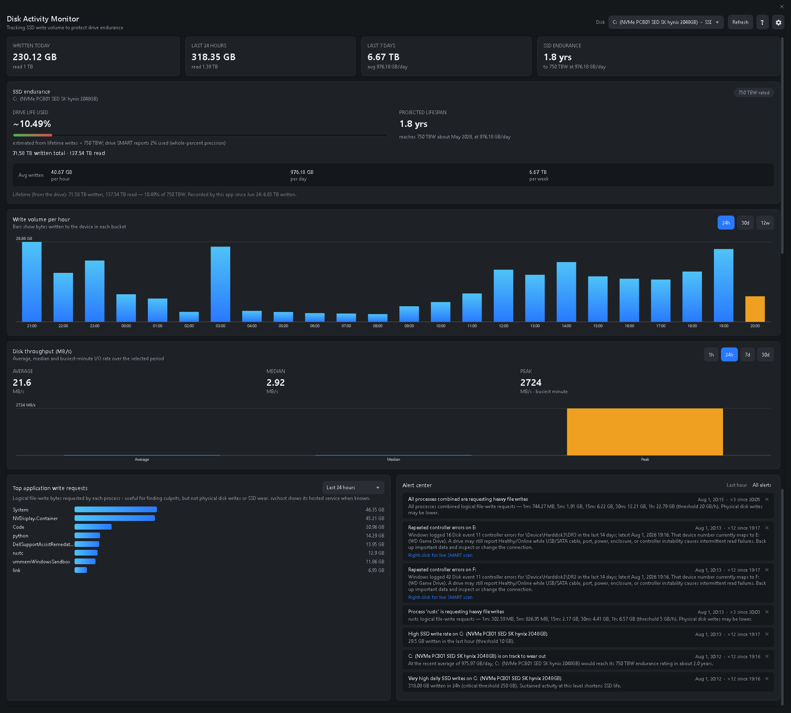
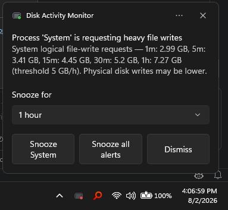

<h1 align="center">
  
  &nbsp;Disk Activity Monitor
</h1>

A lightweight Windows tool that tracks how much data is **written to and read from your
drives over time**, so you can spot processes that hammer an SSD and protect its limited
write endurance. It focuses on **aggregate trends** (MB/GB per hour, day and week) rather
than noisy instantaneous values.

---

## Why this exists

Consumer SSDs are rated for a finite **TBW** (terabytes written). A misbehaving app that
writes continuously can chew through that budget far faster than normal use. This tool makes
that visible: it answers *"how much am I writing per day, and what is responsible?"* and
warns you when a drive or process crosses a threshold you set.

---

## Features

<table>
  <tr>
    <td width="33%" align="center">
      <h3>📊 Disk Trends</h3>
      Follow total physical bytes written across an hour, day, week, month, or custom date range.
    </td>
    <td width="33%" align="center">
      <h3>🔎 Process Attribution</h3>
      Find the applications generating write pressure with ETW-based logical file I/O tracking.
    </td>
    <td width="33%" align="center">
      <h3>💾 SSD Endurance</h3>
      Combine rated TBW, lifetime writes, SMART wear, and current activity into a lifespan projection.
    </td>
  </tr>
  <tr>
    <td width="33%" align="center">
      <h3>🔔 Proactive Alerts</h3>
      Detect heavy writes and repeated Windows Disk event 11 controller errors with tunable thresholds.
    </td>
    <td width="33%" align="center">
      <h3>🩺 Live SMART Diagnostics</h3>
      Run read-only health scans with Windows reliability data and direct NVMe telemetry when available.
    </td>
    <td width="33%" align="center">
      <h3>⏸️ Safe Auto-Suspend</h3>
      Confirm or automatically freeze runaway writers, then resume only the exact recorded process.
    </td>
  </tr>
  <tr>
    <td width="33%" align="center">
      <h3>🤖 Private TBW Lookup</h3>
      Search endurance evidence with Serper; verify locally with Foundry or use deterministic parsing.
    </td>
    <td width="33%" align="center">
      <h3>🗂️ Alert History</h3>
      Review, dismiss, restore, and snooze retained alerts while the tray icon reflects current severity.
    </td>
    <td width="33%" align="center">
      <h3>🔐 Local and Self-Contained</h3>
      Keep monitoring data on-device in SQLite and protect per-user API keys with Windows DPAPI.
    </td>
  </tr>
  <tr>
    <td colspan="3" align="center">
      <h3>🔔 Notifications</h3>
      Act on heavy-write alerts from Windows: choose a snooze duration, snooze one process or all alerts, or dismiss the notification.
    </td>
  </tr>
</table>

---

## Screenshots

<p align="center">
  
</p>

<p align="center"><em>Full dashboard with per-drive totals, endurance telemetry, live read/write activity, trends, process attribution, active alerts, and suspension state.</em></p>

<h3 align="center">Actionable notifications</h3>

<p align="center">
  
</p>

<p align="center"><em>Choose how long to snooze a noisy process, pause all alerts, or dismiss the notification.</em></p>

---

## Download

Self-contained installers (no .NET runtime required on the target machine) are published as
[GitHub Release assets](https://github.com/andrewtheart/DiskActivityMonitor/releases):

| Architecture | Installer |
|---|---|
| **x64** (64-bit Intel/AMD) | Download `DiskActivityMonitor-Setup-<version>-x64.exe` from the [latest release](https://github.com/andrewtheart/DiskActivityMonitor/releases/latest). |
| **x86** (32-bit) | Download `DiskActivityMonitor-Setup-<version>-x86.exe` from the [latest release](https://github.com/andrewtheart/DiskActivityMonitor/releases/latest). |

The installer registers a Windows Service (auto-start), adds a Start Menu shortcut, and
optionally creates a startup entry so the tray dashboard launches at sign-in.
Service binaries are pinned to the expected Program Files directory. Setup rejects reparse
points and applies protected ownership and ACLs through no-follow directory handles.

When you reinstall or upgrade, setup asks whether to keep your existing settings and your existing
monitoring database, showing the database's size, when collection started, and when it was last
updated. Each prompt offers **Delete existing data** and **Keep existing data**, with keeping as
the focused default. Choosing to delete renames the existing database (and its journal files) with
a timestamp beside it rather than erasing your history.

---

## Requirements

### Installed/self-contained release

- Windows 10 or Windows 11.
- No separate .NET runtime is required.

### Development/build machine

- .NET 10 SDK.
- [Inno Setup 6](https://jrsoftware.org/isinfo.php) to build installers.
- Authenticated GitHub CLI (`gh`) only when using installer `-Push` release automation.
- Foundry Local plus a suitable local model only for the optional local-verification lookup mode. When Foundry
  Local is missing, the lookup modal can install Microsoft's official `Microsoft.FoundryLocal`
  package through Windows Package Manager (`winget`) and then continue setup in-app. The degraded
  Serper-only mode does not install, start, or require Foundry Local.

---

## Quick start (development, no admin)

```powershell
# From the repo root — builds, then launches the collector + dashboard:
.\run.ps1

# Or force a rebuild first:
.\run.ps1 -Build

# Or use the scripts\run-dev.ps1 helper that launches both in separate windows:
.\scripts\run-dev.ps1
```

This builds everything, starts the collector in one window, and opens the dashboard. Give the
collector a couple of minutes so the per-minute buckets accumulate; charts fill in as history
grows.

## Install as a Windows Service (recommended)

Run an **elevated** PowerShell:

```powershell
.\scripts\install.ps1
```

This:
1. Publishes staging output to `.\publish\`.
2. Copies the runnable service and tray files to `%ProgramFiles%\Disk Activity Monitor Dev\`, where standard users have read/execute access only.
3. Installs and starts the **DiskActivityMonitor** Windows service (auto-start at boot).
4. Adds a Startup shortcut so the tray app launches at logon.
5. Launches the tray app immediately.

To remove it (elevated):

```powershell
.\scripts\uninstall.ps1
```

Collected history and settings are left in `%ProgramData%\DiskActivityMonitor\`; delete that
folder if you also want to discard the data. Per-user preferences and DPAPI-protected lookup
keys remain under `%LOCALAPPDATA%\DiskActivityMonitor\`.

---

## Using the dashboard

- **Disk selector** (top right): choose one tagged physical disk or **All disks**. Aggregate mode
  sums physical totals, cumulative writes, and throughput across every disk. The live chart keeps
  separate read/write lines and legend colors for each disk. SMART wear, TBW percentage, and
  projected lifespan remain explicitly per-drive because combining them would be misleading.
- **Summary cards**: written today, last 24h, last 7 days, and an endurance/projection card.
- **Rated-TBW pill**: right-click the **TBW rated/estimated** badge in SSD endurance and choose
  **Look up rated TBW**. This forces a fresh lookup even if the drive already has a configured
  rating or cached result. A dedicated modal shows Serper search progress, evidence analysis,
  empty/error states, source agreement, and explicit **Apply single** / **Apply range** actions.
  Choose **Foundry Local verification** for local-model analysis or **Serper-only evidence parsing**
  for a degraded deterministic path that accepts only explicit, capacity-matched snippet values.
  Nothing changes until an Apply action is selected.
  If Foundry Local is absent, choose **Install Foundry Local** in the modal. The app installs the
  exact Microsoft package through `winget`, verifies the CLI, and then offers the separate local
  model download when needed. Windows may request installation approval.
  Google's Custom Search JSON API is closed to new customers; its 100 free daily queries apply
  only to existing customers until the service is retired. New setups should select the supported
  **Serper** backend in Settings.
- **Total written over time**: toggle **1h / 24h / 7d / 30d**, or choose **Custom** start and
  through dates. The through date is inclusive; selecting today ends the range at the current
  time. The line shows the cumulative total, while the header reports both the range increase and
  its average rate per hour, day, or week. When the drive exposes lifetime writes, the current
  value is anchored to that SMART total and the historical movement is reconstructed from physical
  writes recorded by the collector. Otherwise the graph starts with writes recorded since
  monitoring began. Time when the service was not monitoring is not invented or distributed into
  the line.
- **Chart controls**: point at the live activity or total-written graph and use the mouse wheel or
  touchpad scroll gesture to shorten or lengthen its time span. Right-click any dashboard chart and
  choose **Configure chart** to set colors per visible disk/metric (or per aggregate metric). Colors
  are saved for the current Windows user. Hover any line vertex, bar, or donut segment to see its
  exact timestamp/label and numeric value.
- **Endurance alerts**: the all-disks default warns when any SSD has less than **1 year** of projected
  remaining life or at most **20% endurance remaining** (more than 80% used). Remaining-life units
  can be days, months, or years, and each disk can override both conditions. Alerts appear in Alert
  center and as native Windows notifications; snoozing one suppresses only that disk's endurance
  rule for the selected duration.
- **Collapsible panels**: use the quiet chevron at the top right of any dashboard or settings card
  to collapse or restore it. Panel state is remembered for the current Windows user.
- **Top application write requests**: logical file-write bytes requested by each process over
  the selected window. This identifies software generating write pressure, but is not a physical
  SSD-wear figure. Service-host processes are labeled (in)e writes when available and falls
  back to writes observed since monitoring started when lifetime telemetry is unavailable.
- Reading some processes owned by other accounts requires the collector to run with
  sufficient privileges (the Windows Service runs as LocalSystem and sees everything).
- Many USB enclosures do not pass SMART telemetry through to Windows. In that case the live scan
  explicitly reports **Limited** rather than treating `Healthy/Online` as proof that the disk,
  cable, port, power supply, or enclosure is fault-free.

---

## Configuration

Machine-wide collector settings live at `%ProgramData%\DiskActivityMonitor\config.json` and can
be edited from the dashboard or by hand (the collector watches the file). Invalid or oversized
replacements are ignored in favor of the last known-good settings. Thresholds are in GB.

| Key | Meaning | Default |
|-----|---------|---------|
| `sampleIntervalSeconds` | Counter sampling cadence | 5 |
| `dashboardRefreshSeconds` | How often the dashboard re-reads the DB and redraws tables, graphs and stats | 15 |
| `liveGraphRetentionMinutes` | Rolling granular physical read/write history shown by the live graph | 15 |
| `retentionDays` | Minute-level history kept before pruning | 365 |
| `processMinMbPerMinute` | Ignore processes writing less than this per minute | 0.5 |
| `ssdWarnGbPerHour` | Warn above this many GB written to an SSD in 1h | 10 |
| `ssdWarnGbPerDay` / `ssdCriticalGbPerDay` | 24h warn / critical thresholds | 100 / 250 |
| `processWarnGbPerHour` | Warn when one process writes this much in 1h | 5 |
| `allProcessesWarnGbPerHour` | Warn when all processes combined write this much in 1h | 20 |
| `alertCooldownMinutes` | Minimum gap between repeats of the same alert | 5 |
| `enableControllerErrorAlerts` | Monitor System log Disk event 11 controller errors | true |
| `controllerErrorWindowDays` | Trailing event-count window | 14 |
| `controllerErrorWarnCount` | Warning threshold inside the event-count window | 3 |
| `controllerErrorCriticalCount` | Critical threshold inside the event-count window | 10 |
| `defaultSsdTbw` / `defaultSsdTbwUpper` | Estimated SSD TBW range when the rating is unknown | 150 / 600 |
| `diskTbwRatings` | Per-disk TBW endurance rating (TB) | none |
| `diskTbwRatingsUpper` | Optional per-disk upper TBW; when set, endurance %/projection are shown as a range | none |
| `defaultEnduranceAlert` | All-disks profile: enabled remaining-life value/unit and remaining-% conditions | 1 year / 20% remaining |
| `diskEnduranceAlertOverrides` | Optional full endurance-alert profile keyed by disk ID | none |
| `tailMaxReadKb` | Maximum decoded data per live-tail poll; total file size is unrestricted | 512 |
| `tailMaxBufferKb` | Maximum decoded text retained by the live-tail viewer | 1024 |

Action-bearing preferences are isolated per Windows user in
`%LOCALAPPDATA%\DiskActivityMonitor\user-settings.json`:

| Key | Meaning | Default |
|-----|---------|---------|
| `enableNotifications` | Show desktop notifications | true |
| `enableTbwWebLookup` | Enable online TBW evidence search | true |
| `suppressTbwOnlineSetupPrompt` | Suppress guided lookup setup at startup | false |
| `webSearchProvider` | Search backend (`serper` recommended; `google` for existing customers) | serper |
| `tbwLookupMethod` | Evidence analysis (`FoundryLocal` or degraded `SerperOnly`) | FoundryLocal |
| `tbwLookupModel` | Optional Foundry Local model override | automatic |
| `autoSuspendRules` | Per-process confirm/automatic suspension rules | none |
| `chartColors` | Per-chart, per-disk/metric color overrides (`#RRGGBB`) | none |
| `collapsedPanels` | Dashboard/settings panel IDs currently collapsed | none |

Upgrades copy legacy notification and online-lookup preferences into the current user's file,
but do not import legacy machine-wide auto-suspend rules.

See [HELP.md](HELP.md#settings-reference) for the full operational explanation of each setting.

---

## Project layout

```
src/
  DiskActivityMonitor.Core/      Shared models, SQLite repo, sampling, detection, alerts
  DiskActivityMonitor.Service/   Background collector (Windows Service / console)
  DiskActivityMonitor.Tray/      WPF system-tray dashboard
  DiskActivityMonitor.Cli/       Command-line client (dam.exe)
tests/
  DiskActivityMonitor.Tests/     xUnit + real STA WPF tests for Core, service, tray, and workflows
installer/
  build-installer.ps1            Publish + compile the Inno Setup installer
  DiskActivityMonitor.iss        Inno Setup script
scripts/
  build-all-installers.ps1       Build x64/x86, optionally commit/push/release
  install.ps1 / uninstall.ps1    Service install/removal (elevated)
  publish-to-azure.ps1           Build/upload installers + portable ZIP and update site card
  run-dev.ps1                    Run both from source (separate windows)
  make-icon.ps1                  Regenerate assets/app.ico from code
HELP.md                          Comprehensive user, CLI, troubleshooting, and release guide
run.ps1                          Build-if-needed + launch service & tray
dam.ps1                          CLI convenience wrapper
```

## Documentation and security

- For usage and troubleshooting, see the comprehensive [HELP.md](HELP.md) guide. The tray app
  also compiles it to HTML and displays it from the top **?** button.
- For the threat model, implemented controls, validation evidence, known limitations, and
  roadmap, see [docs/security/security.md](docs/security/security.md).

## Building

```powershell
# Build the full solution
dotnet build .\DiskActivityMonitor.slnx -c Release

# Run the full test suite
dotnet test .\tests\DiskActivityMonitor.Tests\DiskActivityMonitor.Tests.csproj -c Release

# Build both self-contained installer architectures with one version
.\scripts\build-all-installers.ps1 -Version 1.5.0

# Preview the build / commit / push / release plan without changing files
.\scripts\build-all-installers.ps1 -Version 1.5.0 -Push -WhatIf

# Build, commit, push, then choose Draft or Published release mode
.\scripts\build-all-installers.ps1 -Version 1.5.0 -Push
```

Output lands in `installer\Output\` as architecture-suffixed executables. See
[installer/README.md](installer/README.md) and [HELP.md](HELP.md#developer-and-release-workflows)
for selected-variant, unattended release-mode, and Azure publication examples.
