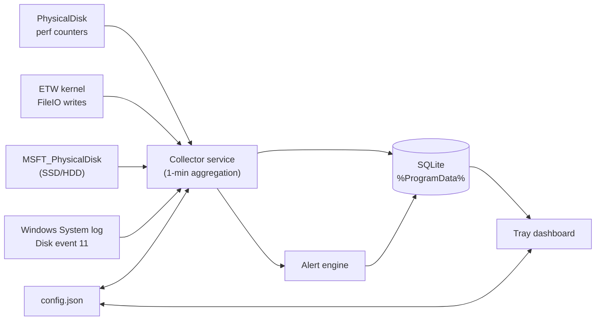

# Disk Activity Monitor

A lightweight Windows tool that tracks how much data is **written to and read from your
drives over time**, so you can spot processes that hammer an SSD and protect its limited
write endurance. It focuses on **aggregate trends** (MB/GB per hour, day and week) rather
than noisy instantaneous values.

It has two parts:

| Component | What it does |
|-----------|--------------|
| **Collector service** (`DiskActivityMonitor.Service`) | A background worker that samples Windows performance counters, aggregates them into one-minute buckets, stores them in a small SQLite database, and raises alerts. Runs as a Windows Service (or a console app). |
| **Tray app** (`DiskActivityMonitor.Tray`) | A system-tray dashboard (WPF) that visualizes the collected trends, ranks the noisiest processes, shows alerts, and lets you tune thresholds. |

Both share a database under `%ProgramData%\DiskActivityMonitor\`.

> **Need usage or troubleshooting help?** See the comprehensive [HELP.md](HELP.md) guide.
> The tray app also compiles this guide to HTML and displays it in-app from the top **?** button.

---

## Why this exists

Consumer SSDs are rated for a finite **TBW** (terabytes written). A misbehaving app that
writes continuously can chew through that budget far faster than normal use. This tool makes
that visible: it answers *"how much am I writing per day, and what is responsible?"* and
warns you when a drive or process crosses a threshold you set.

---

## Features

- **Per-disk write/read trends** charted per **hour (24h)**, **day (30d)**, and **week (12w)**.
- **Automatic SSD vs HDD detection** via the Windows Storage WMI provider, so endurance
  features apply to solid-state drives.
- **Top writing processes** over a selectable window (last minute through past year), via the
  ETW kernel `FileIO` provider, to pinpoint culprits.
- **Auto-suspend rules** that freeze a process when its rolling-hour writes exceed a limit -
  either after a one-click toast confirmation (the default) or automatically.
- **SSD endurance projection** — enter a drive's TBW rating and it estimates years-to-TBW at
  your current write rate. When lifetime-write telemetry is available, **Drive Life Used** is
  calculated from lifetime writes / rated TBW and displayed with up to two decimal places.
- **On-demand rated-TBW lookup** — right-click the **“TBW rated”** pill to search the web and
  extract candidate endurance ratings with the configured local Foundry model.
- **Guided online-lookup setup** — on startup, the tray offers optional Serper setup until a key
  is configured or **Don't show this again** is selected. API keys are encrypted for the current
  Windows account using DPAPI rather than stored as plaintext.
- **Rolling-window alerts** for high SSD writes (per hour / per day) and heavy single
  processes, with configurable thresholds and a cooldown to avoid spam.
- **Storage controller alerts** from Windows System log **Disk event 11**, grouped by
  physical disk over a configurable trailing window to catch repeated cable, port, power,
  enclosure, or controller instability even when a drive still reports Healthy/Online.
- **Live SMART scan from controller alerts** — right-click an affected alert for an in-app,
  read-only health report combining Windows storage health, reliability counters and direct
  NVMe SMART telemetry where the hardware exposes it.
- **Persistent alert dismissal and complete history** — dismiss grouped rows from the main
  one-hour view, review every retained record under **All alerts**, and restore dismissed records.
- **Tray icon status color** (green / amber / red) reflecting the worst non-dismissed recent alert,
  plus optional desktop toast notifications.
- **Tunable settings** edited live from the dashboard; the collector picks up changes
  automatically.
- **In-app compiled help** — the top **?** button opens a searchable, navigable HTML help modal
  generated from `HELP.md`, with a readable Markdown fallback if WebView2 cannot initialize.
- **Self-contained data** in `%ProgramData%\DiskActivityMonitor\` (SQLite, WAL mode) with
  automatic pruning after a configurable retention period.

---

## Download

Self-contained installers (no .NET runtime required on the target machine) are published as
[GitHub Release assets](https://github.com/andrewtheart/DiskActivityMonitor/releases):

| Architecture | Installer |
|---|---|
| **x64** (64-bit Intel/AMD) | Download `DiskActivityMonitor-Setup-<version>-x64.exe` from the [latest release](https://github.com/andrewtheart/DiskActivityMonitor/releases/latest). |
| **x86** (32-bit) | Download `DiskActivityMonitor-Setup-<version>-x86.exe` from the [latest release](https://github.com/andrewtheart/DiskActivityMonitor/releases/latest). |

The installer registers a Windows Service (auto-start), adds a Start Menu shortcut, and
optionally creates a startup entry so the tray dashboard launches at sign-in.

---

## Requirements

### Installed/self-contained release

- Windows 10 or Windows 11.
- No separate .NET runtime is required.

### Development/build machine

- .NET 10 SDK.
- [Inno Setup 6](https://jrsoftware.org/isinfo.php) to build installers.
- Authenticated GitHub CLI (`gh`) only when using installer `-Push` release automation.
- Foundry Local plus a suitable local model only for the optional rated-TBW lookup.

---

## Quick start (development, no admin)

```powershell
# From the repo root — builds, then launches the collector + dashboard:
.\run.ps1

# Or force a rebuild first:
.\run.ps1 -Build

# Or use the scripts\run-dev.ps1 helper that launches both in separate windows:
.\scripts\run-dev.ps1
```

This builds everything, starts the collector in one window, and opens the dashboard. Give the
collector a couple of minutes so the per-minute buckets accumulate; charts fill in as history
grows.

## Install as a Windows Service (recommended)

Run an **elevated** PowerShell:

```powershell
.\scripts\install.ps1
```

This:
1. Publishes the service and tray app to `.\publish\`.
2. Installs and starts the **DiskActivityMonitor** Windows service (auto-start at boot).
3. Adds a Startup shortcut so the tray app launches at logon.
4. Launches the tray app immediately.

To remove it (elevated):

```powershell
.\scripts\uninstall.ps1
```

Collected history and settings are left in `%ProgramData%\DiskActivityMonitor\`; delete that
folder if you also want to discard the data.

---

## Using the dashboard

- **Disk selector** (top right): SSDs are listed first and tagged. Trends and endurance apply
  to the selected disk.
- **Summary cards**: written today, last 24h, last 7 days, and an endurance/projection card.
- **Rated-TBW pill**: right-click the **“xxx TBW rated”** badge in SSD endurance and choose
  **Look up rated TBW**. This forces a fresh lookup even if the drive already has a configured
  rating or cached result. A dedicated modal shows Serper search progress, local-model verification,
  empty/error states, source confidence, and Apply actions; nothing changes without confirmation.
  Google's Custom Search JSON API is closed to new customers; its 100 free daily queries apply
  only to existing customers until the service is retired. New setups should select the supported
  **Serper** backend in Settings.
- **Trend chart**: toggle **24h / 30d / 12w**. Bars are bytes written to the device in each
  bucket; the current bucket is highlighted.
- **Top application write requests**: logical file-write bytes requested by each process over
  the selected window. This identifies software generating write pressure, but is not a physical
  SSD-wear figure. Service-host processes are labeled with the hosted service when known (for
  example, `svchost (SDRSVC: Windows Backup)`).
- **Alert center**: a rolling one-hour view of non-dismissed alerts. Repeated controller errors
  appear here alongside write/endurance alerts and can also raise desktop notifications. Click the
  **x** on a row (or use its context menu) to dismiss that occurrence permanently from the main
  view. **All alerts** opens the complete retained history, includes dismissed records, and lets
  you restore them. A future occurrence of the same condition can still appear. The tray icon
  color resets to green when no non-dismissed alerts remain in the window.
- **Live SMART scan**: right-click a controller-error alert and choose **Run live SMART scan**.
  The result panel shows Windows health/operational status, SMART access, alert-window controller
  errors, temperature, model/firmware/serial, lifetime I/O, and actionable findings. The scan is
  read-only and does not start a destructive or long-running ATA/NVMe self-test.
- **Settings**: thresholds (in GB), sample interval, desktop notifications, and the selected
  drive's **TBW rating** (TB). Click **Save settings**; the collector applies them live.
- **Online lookup setup**: the startup prompt explains what is sent online, links to Serper signup,
  accepts the API key, and stores it with Windows DPAPI. Choosing **Not now** shows the prompt again
  at the next startup unless **Don't show this again** is checked. Guided setup can be reopened from
  Settings at any time.

The tray icon's right-click menu offers *Open dashboard*,
*Open data folder*, and *Exit*. Closing the dashboard window hides it to the tray; use *Exit*
to quit the app.

### Auto-suspending heavy writers

The **Auto-suspend rules** card lets you stop a runaway writer before it wears the disk:

- **Add a rule** for a process already seen by the monitor (pick it from the dropdown) or
  **Browse for an `.exe`** on disk for one that hasn't been seen yet - the rule matches the
  executable's image name.
- Set a **limit** in GB written per rolling hour. When a process exceeds it, the app reacts.
- Each rule is either **confirm** (a toast asks before suspending - the default for every new
  rule) or **Auto** (suspend immediately, then notify with a *Resume* button).
- Suspended processes appear under **Currently suspended** with a **Resume** button, and the
  auto-suspend toasts carry *Suspend now* / *Resume* actions.

Suspending freezes every thread in the target. The dashboard runs in your user session, so it
can suspend your own processes; suspending an elevated/other-user process requires the app to
run elevated and otherwise reports “access denied”.

---

## Command-line interface (`dam`)

A full CLI (`dam.exe`) reads and writes the same database and `config.json` as the service and
tray, so you can inspect activity, manage alerts/snoozes, and change settings from a terminal.

```powershell
# From the repo root (builds on first run):
.\dam.ps1 status
.\dam.ps1 top --minutes 30 --count 15

# Or run the built exe directly:
src\DiskActivityMonitor.Cli\bin\Debug\net10.0-windows\dam.exe status
```

| Command | What it does |
|---------|--------------|
| `status` | Service/DB status, disk count, non-dismissed alerts, snoozes |
| `disks` | List monitored disks (media, size, SMART wear) |
| `summary [--disk ID] [--all]` | Writes today / last 24h / last 7d |
| `top [--minutes N] [--count N]` | Top processes by writes in a window (default 60m, 10) |
| `process <name>` | Writes for a process across 1m/5m/15m/30m/1h/24h |
| `trends [--range hour\|day\|week] [--count N] [--disk ID]` | Write trend with bar chart |
| `endurance [--disk ID] [--all]` | SSD TBW usage, SMART wear, projection |
| `watch [--interval N]` | Live auto-refreshing dashboard (Ctrl+C to exit) |
| `alerts [--all] [--count N] [--full]` | List alerts (unacknowledged by default) |
| `ack <id>... ` / `ack --all` | Acknowledge alerts |
| `snooze list` | Show active snoozes |
| `snooze process <name> <dur>` | Snooze a process (e.g. `30m`, `1h`, `1d`, `1w`) |
| `snooze all <dur>` | Snooze every alert for a duration |
| `snooze clear <name>\|--global\|--all` | Clear snoozes |
| `config get [key]` | Print all config, or one key |
| `config set <key> <value>` | Change a threshold/setting (the service reloads live) |
| `help` / `version` | Usage / version |

---

## How it works



- **Disk volume** is read from the `PhysicalDisk\Disk Read/Write Bytes/sec` counters and
  integrated over each sampling interval. These reflect bytes that actually reached the
  device, which is what matters for SSD wear.
- **Per-process** numbers come from the Windows kernel ETW `FileIO` provider: the byte size of
  every logical file read/write request is attributed to the process that issued it, aggregated
  by process/service name. `svchost` PIDs are resolved to their hosted Windows service(s) when
  known. Because only genuine file-system writes raise these events, named-pipe, device-ioctl
  and other non-disk I/O are excluded — so a process stuck in an IPC/UI loop no longer shows up
  as a heavy disk writer. The ETW session needs elevation; the collector runs as LocalSystem.
  When ETW is unavailable (e.g. run un-elevated during development) it falls back to cumulative
  `GetProcessIoCounters` deltas, which are an *upper bound* that mixes file, pipe and device I/O.
- Samples are aggregated into **one-minute buckets** and rolled up to hour/day/week for
  charting in local time.
- Once per minute, the collector reads System log provider `disk`, event ID `11`, counts records
  by `\Device\HarddiskN` across the configured window, and maps that disk number to the currently
  detected volume/model. USB/removable disk numbers can change after reconnecting hardware, so
  each alert retains the original Windows device path and describes the volume mapping as current.

### Accuracy notes

- Per-process numbers are *logical file-write requests*: bytes an application asked Windows to
  write above the cache/storage stack. Windows may cache, coalesce, overwrite or eliminate some
  requests before they become physical I/O, and the requests may target several disks. Therefore
  these numbers identify the software creating pressure but can be higher than actual device
  writes. The per-disk physical totals remain authoritative for SSD endurance. (Under the
  un-elevated fallback reader, per-process numbers over-count further because they also include
  pipe/device I/O.)
- TBW projections assume your recent observed average write rate continues; they are estimates,
  not guarantees. Consumed endurance uses drive-reported lifetime writes when available and falls
  back to writes observed since monitoring started when lifetime telemetry is unavailable.
- Reading some processes owned by other accounts requires the collector to run with
  sufficient privileges (the Windows Service runs as LocalSystem and sees everything).
- Many USB enclosures do not pass SMART telemetry through to Windows. In that case the live scan
  explicitly reports **Limited** rather than treating `Healthy/Online` as proof that the disk,
  cable, port, power supply, or enclosure is fault-free.

---

## Configuration

Settings live at `%ProgramData%\DiskActivityMonitor\config.json` and can be edited from the
dashboard or by hand (the collector watches the file). Thresholds are in GB.

| Key | Meaning | Default |
|-----|---------|---------|
| `sampleIntervalSeconds` | Counter sampling cadence | 5 |
| `dashboardRefreshSeconds` | How often the dashboard re-reads the DB and redraws tables, graphs and stats | 15 |
| `retentionDays` | Minute-level history kept before pruning | 365 |
| `processMinMbPerMinute` | Ignore processes writing less than this per minute | 0.5 |
| `ssdWarnGbPerHour` | Warn above this many GB written to an SSD in 1h | 10 |
| `ssdWarnGbPerDay` / `ssdCriticalGbPerDay` | 24h warn / critical thresholds | 100 / 250 |
| `processWarnGbPerHour` | Warn when one process writes this much in 1h | 5 |
| `allProcessesWarnGbPerHour` | Warn when all processes combined write this much in 1h | 20 |
| `alertCooldownMinutes` | Minimum gap between repeats of the same alert | 5 |
| `enableControllerErrorAlerts` | Monitor System log Disk event 11 controller errors | true |
| `controllerErrorWindowDays` | Trailing event-count window | 14 |
| `controllerErrorWarnCount` | Warning threshold inside the event-count window | 3 |
| `controllerErrorCriticalCount` | Critical threshold inside the event-count window | 10 |
| `defaultSsdTbw` / `defaultSsdTbwUpper` | Fallback SSD TBW rating and optional upper range | 750 / none |
| `diskTbwRatings` | Per-disk TBW endurance rating (TB) | none |
| `diskTbwRatingsUpper` | Optional per-disk upper TBW; when set, endurance %/projection are shown as a range | none |
| `tbwProjectionWarnYears` / `tbwProjectionCriticalYears` | Projected-years warning / critical thresholds | 2 / 1 |
| `ssdWearWarnPercent` | SMART wear warning threshold | 90 |
| `enableNotifications` | Show desktop balloon notifications | true |
| `enableTbwWebLookup` | Enable online evidence search + local verification | true |
| `suppressTbwOnlineSetupPrompt` | Suppress guided lookup setup at startup | false |
| `webSearchProvider` | Search backend (`serper` recommended; `google` for existing customers) | serper |
| `tbwLookupModel` | Optional Foundry Local model override | automatic |
| `autoSuspendRules` | Per-process confirm/automatic suspension rules | none |

See [HELP.md](HELP.md#settings-reference) for the full operational explanation of each setting.

---

## Project layout

```
src/
  DiskActivityMonitor.Core/      Shared models, SQLite repo, sampling, detection, alerts
  DiskActivityMonitor.Service/   Background collector (Windows Service / console)
  DiskActivityMonitor.Tray/      WPF system-tray dashboard
  DiskActivityMonitor.Cli/       Command-line client (dam.exe)
tests/
  DiskActivityMonitor.Tests/     xUnit + real STA WPF tests for Core, service, tray, and workflows
installer/
  build-installer.ps1            Publish + compile the Inno Setup installer
  DiskActivityMonitor.iss        Inno Setup script
scripts/
  build-all-installers.ps1       Build x64/x86, optionally commit/push/release
  install.ps1 / uninstall.ps1    Service install/removal (elevated)
  publish-to-azure.ps1           Build/upload installers + portable ZIP and update site card
  run-dev.ps1                    Run both from source (separate windows)
  make-icon.ps1                  Regenerate assets/app.ico from code
HELP.md                          Comprehensive user, CLI, troubleshooting, and release guide
run.ps1                          Build-if-needed + launch service & tray
dam.ps1                          CLI convenience wrapper
```

## Building

```powershell
# Build the full solution
dotnet build .\DiskActivityMonitor.slnx -c Release

# Run the full test suite
dotnet test .\tests\DiskActivityMonitor.Tests\DiskActivityMonitor.Tests.csproj -c Release

# Build both self-contained installer architectures with one version
.\scripts\build-all-installers.ps1 -Version 1.5.0

# Preview the build / commit / push / release plan without changing files
.\scripts\build-all-installers.ps1 -Version 1.5.0 -Push -WhatIf

# Build, commit, push, then choose Draft or Published release mode
.\scripts\build-all-installers.ps1 -Version 1.5.0 -Push
```

Output lands in `installer\Output\` as architecture-suffixed executables. See
[installer/README.md](installer/README.md) and [HELP.md](HELP.md#developer-and-release-workflows)
for selected-variant, unattended release-mode, and Azure publication examples.
