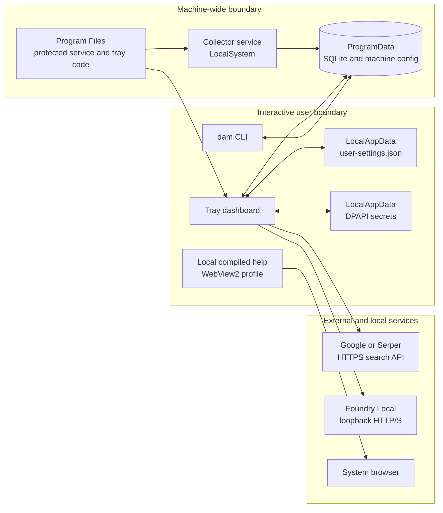

# Disk Activity Monitor Security

Last reviewed: 2026-08-01

This document describes the security architecture, threat model, implemented controls, validation evidence, known limitations, and maintenance requirements for Disk Activity Monitor (DAM). It is the canonical security reference for the application. General installation and usage documentation remains in [README.md](../../README.md), [HELP.md](../../HELP.md), and [installer/README.md](../../installer/README.md).

## Executive summary

Disk Activity Monitor intentionally separates privileged collection from interactive actions:

- The Windows service runs as `LocalSystem` because kernel ETW, event-log access, and some storage diagnostics require elevation.
- The tray application and CLI run as the interactive user.
- Privileged service binaries are installed under a protected, fixed Program Files path.
- Machine-wide collection thresholds are stored in shared ProgramData.
- Action-bearing settings, including auto-suspend and network lookup preferences, are stored per user.
- API keys are stored per user and protected with Windows DPAPI `CurrentUser` scope.
- Internet search credentials are sent in headers over HTTPS using a transport that does not follow redirects.
- Foundry Local communication is limited to HTTP or HTTPS loopback endpoints and does not use redirects, cookies, or a proxy.
- Process suspension records the PID, process creation time, and executable path from the same process handle used to suspend. Resume fails closed if that identity cannot be verified.
- Installer security changes are performed through no-follow directory handles, with object identity held across ownership and DACL updates.
- Configuration writes use random, exclusive temporary files and publish new in-memory state only after durable persistence succeeds.

The most important remaining limitation is the shared `%ProgramData%\DiskActivityMonitor` data directory. Standard users need to write there for the current tray/CLI design, so its SQLite telemetry and machine configuration are not a tamper-evident boundary between mutually untrusted local accounts. A complete fix requires moving mutations behind authenticated service IPC and making shared data read-only to interactive users.

## Security goals

The current security design aims to:

1. Prevent a standard user from replacing code executed by the `LocalSystem` service.
2. Prevent installer path redirection through junctions, symlinks, or directory replacement races.
3. Keep API credentials out of machine-wide settings, URLs, logs, and other users' profiles.
4. Prevent remote redirects from carrying credential headers to a different origin.
5. Prevent Foundry Local discovery from selecting a non-loopback endpoint.
6. Prevent process-name collisions and PID reuse from resuming an unintended process.
7. Prevent stale settings snapshots, concurrent writers, malformed files, or failed writes from silently publishing inconsistent configuration.
8. Ensure machine-wide data cannot silently introduce action-bearing preferences into another user's session.
9. Treat local-model output and web-search snippets as untrusted evidence rather than authoritative configuration.
10. Fail safely when security-sensitive state is missing, corrupt, inaccessible, or ambiguous.

## Non-goals and trust assumptions

The current design does not claim to defend against:

- A compromised administrator, `SYSTEM`, Windows kernel, or trusted installer process.
- A compromised Windows DPAPI implementation or an attacker executing as the same Windows user while secrets are in memory.
- A malicious root certificate, trusted TLS interception product, or compromised operating-system proxy configuration.
- Tampering with shared telemetry by another local user who has legitimate write access to the ProgramData data directory.
- Denial of service by a local user who can modify or remove shared data.
- A malicious local process impersonating an unauthenticated Foundry Local loopback service.
- Supply-chain compromise before installation. The repository does not currently configure Authenticode signing for the installer or application binaries.
- Recovery of a process that was suspended by a previous version but has no exact persisted identity. The app deliberately refuses to guess.

Windows, NTFS ACL enforcement, DPAPI, the service control manager, HTTPS certificate validation, and the integrity of installed dependencies are trusted foundations.

## Architecture and trust boundaries



### Principals

| Principal | Normal privilege | Security role |
|---|---:|---|
| Installer | Administrator | Creates fixed directories, applies ownership/DACLs, and registers the service. |
| Collector service | `LocalSystem` | Collects ETW/storage/event telemetry and writes machine-wide data. |
| Tray | Interactive user | Displays data, stores per-user preferences, sends notifications, and performs process control within the user's access rights. |
| CLI | Interactive user | Reads telemetry and updates machine-wide collector settings. |
| Foundry Local | Separate local process | Performs local extraction from web-search snippets. It is not trusted as an authority. |
| Search provider | Remote HTTPS service | Returns untrusted search results. Receives its provider-specific API key. |
| WebView2 | Interactive user | Renders only the packaged help document; external links are delegated to the system browser. |

### Data classification

| Data | Location | Scope | Confidentiality | Integrity expectation |
|---|---|---|---|---|
| Service/tray binaries | `%ProgramFiles%\Disk Activity Monitor` | Machine | Public code | Protected from standard-user modification by owner and DACL. |
| Machine configuration | `%ProgramData%\DiskActivityMonitor\config.json` | Machine | Non-secret | Shared and writable by design; validated and bounded, but not trusted against another local user. |
| Telemetry/history | `%ProgramData%\DiskActivityMonitor\diskactivity.db*` | Machine | Potentially sensitive activity metadata | Shared and writable by design; not tamper-evident. |
| Suspended-process state | SQLite `suspended_processes` | Machine | Process metadata | Exact identity is validated before resume; storage itself is shared. |
| User preferences | `%LOCALAPPDATA%\DiskActivityMonitor\user-settings.json` | User | Non-secret | Controlled by the current user; action-bearing settings do not cross users through machine config. |
| API keys | `%LOCALAPPDATA%\DiskActivityMonitor\ai-secrets.json` | User | Secret | DPAPI `CurrentUser`; plaintext legacy values are migrated. |
| Google CSE ID | Same secrets file | User | Non-secret | Stored as plaintext by design. |
| WebView2 profile | `%LOCALAPPDATA%\DiskActivityMonitor\WebView2` | User | Browser state | Per-user; embedded help has a restricted navigation policy. |

## Threat model

The hardening work considered the following attacker capabilities and failure modes:

- A standard local user can create files and directories where ACLs permit it.
- A local user may attempt to redirect an elevated installer or service through a junction, symlink, mount point, or path replacement race.
- A local user may run an executable with the same image name as a legitimate target.
- A PID may be reused after the original process exits.
- A config/settings file may be oversized, malformed, invalid UTF-8, replaced during a read, or concurrently updated.
- A durable write may fail after an in-memory mutation has been prepared.
- A search endpoint may return an HTTP redirect to an attacker-controlled origin.
- A local or remote endpoint may return malicious, malformed, or misleading content.
- A local model may hallucinate an endurance rating not present in evidence.
- A WebView link may attempt to launch `file:`, `javascript:`, or a custom protocol.
- An installer/uninstaller may accidentally stop an unrelated process with the same image name.
- Legacy machine-wide preferences may contain action-bearing rules planted by another local user.

## Implemented controls

### 1. Privilege separation

The collector service runs as `LocalSystem` only because its collection responsibilities require privileged Windows facilities. User interaction remains in the non-elevated tray and CLI.

Security-sensitive behavior is divided by scope:

- `AppConfig` contains machine-wide sampling, retention, alert thresholds, controller-error settings, and TBW ratings.
- `UserSettings` contains notifications, web lookup, onboarding suppression, model preference, and auto-suspend rules.
- API credentials are stored separately in `AiSecretsStore`.

This separation prevents one user from planting an auto-suspend rule or network-use preference in machine-wide configuration and having it silently execute in another user's tray session.

On first migration from the older combined format, notification and lookup preferences may be imported. Legacy machine-wide auto-suspend rules are deliberately not imported and must be recreated by each user.

Relevant implementation:

- [AppConfig.cs](../../src/DiskActivityMonitor.Core/Configuration/AppConfig.cs)
- [UserSettingsStore.cs](../../src/DiskActivityMonitor.Core/Configuration/UserSettingsStore.cs)
- [AiSecrets.cs](../../src/DiskActivityMonitor.Core/Ai/AiSecrets.cs)

### 2. Protected service installation

#### Fixed install paths

The production installer is pinned to:

```text
%ProgramFiles%\Disk Activity Monitor
```

The development installer is pinned to:

```text
%ProgramFiles%\Disk Activity Monitor Dev
```

The production installer disables directory selection and previous-directory reuse. The development script rejects any `InstallRoot` that is not exactly its expected path. These controls prevent an administrator from accidentally registering a `LocalSystem` service whose image lives in a standard-user-writable directory.

#### No-follow handle validation

[scripts/secure-directory.ps1](../../scripts/secure-directory.ps1) opens directories with:

- `FILE_FLAG_OPEN_REPARSE_POINT`, so the final path object is opened rather than followed.
- `FILE_FLAG_BACKUP_SEMANTICS`, required for directory handles.
- Read/write sharing but no delete sharing, preventing the opened object from being deleted or replaced while security is applied.

The helper then:

1. Reads attributes from the handle.
2. Requires the object to be a directory.
3. Rejects any object carrying `FILE_ATTRIBUTE_REPARSE_POINT`.
4. Captures volume serial number and file index as the directory identity.
5. Enables only the ownership/restore privileges needed for the operation.
6. Applies trusted ownership through an open handle with `SetSecurityInfo`.
7. Opens the DACL handle while the owner handle remains open.
8. Compares both handles' volume/file identities.
9. Applies a protected DACL through the handle.

The installer also validates the relevant Program Files, application, service, tray, ProgramData, and application-data directories before use. The production helper is embedded into the installer and extracted at runtime.

#### ACL profiles

| Profile | Owner/group | `SYSTEM` | Administrators | Built-in Users |
|---|---|---|---|---|
| Install/code | Administrators | Inherited full control | Inherited full control | Inherited read and execute |
| Shared data | Administrators | Inherited full control | Inherited full control | Root access plus inherited descendant write/modify rights required by the current tray/CLI design |

Both profiles use protected DACLs. Standard users cannot modify service code, but they can mutate shared data by design. See [Known limitations](#known-limitations-and-residual-risks).

#### Ordering and failure behavior

Before copying service code, setup:

1. Validates the exact install location.
2. Secures the application and data directories.
3. Stops only the tray executable at the exact installed path.
4. Stops and removes the prior service registration.
5. Optionally removes selected settings.
6. Copies binaries and registers the service.

A security-helper failure aborts installation instead of continuing with weak permissions.

Relevant implementation:

- [DiskActivityMonitor.iss](../../installer/DiskActivityMonitor.iss)
- [install.ps1](../../scripts/install.ps1)
- [secure-directory.ps1](../../scripts/secure-directory.ps1)

### 3. Exact process termination during setup

Install and uninstall operations do not kill every process with the tray image name.

- The production installer queries `Win32_Process`, normalizes each executable path, and stops only the PID whose path equals the expected installed tray path.
- The development installer obtains each process's `MainModule.FileName`, normalizes it, and stops only an exact path match.
- Process IDs are used only after path selection; broad `taskkill /IM` or name-wide `Stop-Process` operations are not used.

This prevents setup for one installation from terminating a same-name executable elsewhere on the machine.

### 4. Atomic and bounded JSON persistence

[AtomicFile.cs](../../src/DiskActivityMonitor.Core/AtomicFile.cs) provides the shared persistence primitive for machine config, user settings, and secrets.

Writes:

- Create a random sibling temporary filename.
- Use `FileMode.CreateNew` to prevent collision reuse.
- Use exclusive sharing.
- Write UTF-8 without a BOM.
- Flush the writer and underlying stream with `flushToDisk: true`.
- Replace the destination using an atomic same-directory move.
- Best-effort delete only the temporary file created by that operation after failure.

Reads used by config and user settings:

- Open one handle for both size validation and content reading.
- Limit input to 1 MiB.
- Reject invalid UTF-8.
- Avoid a check-then-reopen size race.

The random temporary file removes the predictable `.tmp` target that previously enabled collision and redirection attacks.

### 5. Configuration snapshot and concurrency safety

`ConfigStore` and `UserSettingsStore` do not expose their mutable internal objects.

- `Current` returns a deep snapshot, including dictionaries and rule collections.
- `Save` clones caller-owned data before persistence.
- `Update(Action<T>)` clones the current state, applies a field-level mutation under a lock, persists it, and only then publishes the new snapshot.
- A failed write leaves the last persisted in-memory snapshot intact.
- File watcher reloads and local writes are serialized through the same gate.
- Change-event subscribers receive a clone, not the internal object.
- Malformed, oversized, inaccessible, or partially written config retains the last known-good value.

Production configuration writers use `Update` rather than stale `Current`/`Save` read-modify-write sequences. This prevents unrelated fields from being lost when the service watcher, tray, or CLI updates configuration concurrently.

Relevant implementation:

- [ConfigStore.cs](../../src/DiskActivityMonitor.Core/Configuration/ConfigStore.cs)
- [UserSettingsStore.cs](../../src/DiskActivityMonitor.Core/Configuration/UserSettingsStore.cs)
- [CliRunner.cs](../../src/DiskActivityMonitor.Cli/CliRunner.cs)
- [MainWindow.xaml.cs](../../src/DiskActivityMonitor.Tray/MainWindow.xaml.cs)

### 6. Secrets at rest

API keys are not stored in machine-wide `config.json`.

`AiSecretsStore` uses:

- `%LOCALAPPDATA%\DiskActivityMonitor\ai-secrets.json`.
- Windows DPAPI `ProtectedData.Protect` and `Unprotect`.
- `DataProtectionScope.CurrentUser`.
- Fixed application-specific entropy (`DiskActivityMonitor.AiSecrets.v1`).
- Atomic replacement for writes.
- Environment-variable fallback for `GOOGLE_API_KEY`, `GOOGLE_CSE_ID`, and `SERPER_API_KEY`.

Google and Serper API keys are encrypted. The Google CSE ID is not a secret and remains plaintext.

Legacy plaintext API-key fields are read once and rewritten into protected fields. A migration failure does not destroy the still-usable key; it is retried on a future load.

DPAPI protects data at rest from other Windows accounts. It does not protect a key from malware already executing as the same user, from a compromised user session, or while the key is present in process memory.

### 7. Credentialed web search

Google and Serper use fixed HTTPS API origins.

- Google sends `X-Goog-Api-Key`; the key is not placed in the query string.
- Serper sends `X-API-KEY`.
- The search transport disables automatic redirects.
- Cookies are disabled.
- A 3xx response is treated as a failed request rather than followed with a credential header.
- Query inputs and the non-secret CSE ID are URI-escaped where applicable.

The search transport may use the Windows/system proxy according to .NET defaults. This is intentional for ordinary internet connectivity and means the operating-system proxy/TLS trust configuration remains part of the trusted computing base.

Relevant implementation: [WebSearch.cs](../../src/DiskActivityMonitor.Core/Ai/WebSearch.cs).

### 8. Foundry Local isolation

Foundry inference runs in a separate process, reducing the impact of a native model-runtime crash on the tray application.

Endpoint controls:

- Discovery accepts only absolute HTTP or HTTPS URLs.
- `Uri.IsLoopback` must be true.
- IPv4 loopback, IPv6 loopback, and `localhost` are supported.
- Non-loopback private and public addresses are rejected.
- Redirects are disabled.
- Cookies are disabled.
- Proxy use is disabled.
- Connection and request timeouts are bounded.
- Every chat request revalidates the endpoint before sending.

Search API keys are not sent to Foundry Local. The local model receives the drive model and already-returned search evidence required for extraction.

Residual limitation: Foundry Local has no application-level authentication. Another process running locally may be able to impersonate a loopback service. Model output is therefore treated as untrusted input and validated before use.

Relevant implementation: [FoundryLocalClient.cs](../../src/DiskActivityMonitor.Core/Ai/FoundryLocalClient.cs).

### 9. Untrusted AI and web evidence

A local model cannot directly change a TBW rating.

The lookup pipeline:

1. Searches for the exact drive model and TBW.
2. Gives the local model indexed search titles/snippets.
3. Requires JSON-only claims tied to a source index.
4. Rejects malformed output, invalid indexes, nonpositive values, and implausibly large values.
5. Requires the exact claimed rating, or an equivalent PBW value, to appear in the attributed source evidence.
6. Requires the requested drive capacity to appear in the same evidence when capacity is known.
7. Deterministically extracts explicit snippet claims as a second path, with nearest-capacity checks for product-family tables.
8. Deduplicates votes by source domain.
9. Shows candidates and source agreement to the user.
10. Changes the configured rating only when the user selects Apply.

This design treats the model as a parser, not an authority, and prevents unsupported model-memory values from becoming configuration.

Relevant implementation: [TbwLookupService.cs](../../src/DiskActivityMonitor.Core/Ai/TbwLookupService.cs).

### 10. Auto-suspend safety

Process suspension is a destructive action and is constrained at several layers.

#### Rule scope

- A rule created by browsing to an executable stores its full path.
- A rule created from historical telemetry is name-wide.
- Name-wide rules are confirmation-only.
- Automatic suspension is available only when a rule has an exact executable path.
- Runtime evaluation enforces this rule even if an older or manually edited settings file says otherwise.
- New rules default to Confirm mode.
- Confirm prompts are rate-limited.

#### Same-handle identity

For each candidate process, `ProcessControl` opens one handle with suspend/resume and limited-query rights. It reads the executable path and process creation time from that same handle before acting.

A successfully suspended process is persisted as:

```text
PID + creation-time FILETIME + normalized executable path
```

This prevents:

- Selecting an unrelated executable that merely has the same image name when a path-bound rule is used.
- Resuming a different process after PID reuse.
- Resuming a same-name process from another directory.

#### Fail-closed resume

Resume opens the recorded PID, rereads its current identity from that handle, and requires all three identity fields to match.

- Missing or corrupt exact identity state does not fall back to process name.
- A mismatched identity remains unresolved.
- Access-denied and native resume failures remain tracked.
- Successfully resumed identities are removed while unresolved identities are retained.
- Persisted identity JSON is bounded to 64 KiB when read.

If no exact identity is available, the UI reports that it cannot safely resume rather than guessing.

Relevant implementation:

- [ProcessControl.cs](../../src/DiskActivityMonitor.Core/Collection/ProcessControl.cs)
- [AutoSuspendManager.cs](../../src/DiskActivityMonitor.Tray/AutoSuspendManager.cs)
- [MonitorRepository.cs](../../src/DiskActivityMonitor.Core/Data/MonitorRepository.cs)
- [AutoSuspendRule.cs](../../src/DiskActivityMonitor.Core/Configuration/AutoSuspendRule.cs)

### 11. Help WebView and external navigation

The in-app help WebView loads only the packaged `HELP.html` file.

Hardening includes:

- Per-user WebView2 data.
- Developer tools disabled.
- Default context menus disabled.
- Browser accelerator keys disabled.
- Host objects disabled.
- Navigation allowed only to the exact packaged local help path.
- Every other embedded navigation is cancelled.
- Only absolute HTTP or HTTPS links may be delegated to the system browser.
- `file:`, `javascript:`, `data:`, and custom protocols are rejected.

HTTP links are allowed because they open outside the embedded WebView. They should still be avoided in authored documentation in favor of HTTPS.

Relevant implementation: [MainWindow.xaml.cs](../../src/DiskActivityMonitor.Tray/MainWindow.xaml.cs).

### 12. Reset and uninstall safety

Fresh-settings installation and uninstall reset only known settings files:

- Machine `config.json`.
- Current user's `user-settings.json`.
- Historical fixed `.tmp` names from older versions.

Monitoring history and DPAPI keys are preserved unless removed separately. Deletion refuses settings directories/files that are reparse points. The installer does not recursively delete the ProgramData tree during a settings reset.

This limits the blast radius of installer-controlled deletion and avoids following an obvious link during cleanup.

## Defense-in-depth controls already present

The application also relies on these broader controls:

- SQLite commands use parameters for user/data values rather than interpolating values into SQL.
- ETW collection falls back to less-privileged Win32 process counters if the kernel session cannot start.
- The live SMART scan is read-only and does not issue a drive self-test.
- Foundry and search operations use cancellation and timeouts.
- Toast activation is handled defensively so malformed activation input cannot crash the tray.
- The tray's single-instance mutex limits duplicate interactive controllers.
- Exceptions from corrupt settings, malformed model output, individual ETW events, browser launch, and toast activation are contained at their trust boundaries.
- Installer and developer scripts avoid broad process-name termination.

## Known limitations and residual risks

### Shared ProgramData integrity and privileged file redirection

Severity: high architectural risk in a hostile multi-user environment.

The tray and CLI currently write directly to the shared SQLite database and machine configuration. The data ACL therefore allows standard-user descendant mutation. Consequences include:

- Another local user can alter telemetry, alerts, snoozes, and machine configuration.
- Another local user can deny service by deleting or corrupting shared files.
- On systems where the user can create links, replacing a database-related child with a link may cause the `LocalSystem` service's pathname-based SQLite open to follow it.

Directory installation controls do not solve replacement of writable child files after installation.

Planned architectural remediation:

1. Make the shared data directory service-owned and read-only to interactive users.
2. Move all machine-state mutations behind authenticated, access-controlled service IPC.
3. Open the database only in the service.
4. Give the tray/CLI read-only snapshots or a query API.
5. Keep user-specific actions and preferences in per-user storage.
6. Add object-level no-follow/link-count validation where Windows and SQLite integration permit it.

Until that redesign, DAM should not treat shared telemetry as trustworthy evidence between mutually untrusted local accounts.

### Name-aggregated process telemetry

Process I/O history is aggregated by image/display name, not by executable path and stable process identity. A different executable with the same name can contribute to the threshold that triggers a path-bound rule.

The action itself is constrained to the configured executable path, and name-wide rules cannot run automatically. However, an exact-path Auto rule may still be triggered by another same-name writer's aggregate.

Recommended use:

- Prefer Confirm mode in hostile or shared environments.
- Review the displayed process/path before approving a suspension.

Future remediation is to persist process identity/path with telemetry and evaluate path-bound rules only against matching identity data.

### Foundry Local impersonation

Loopback restriction prevents remote endpoint escape but does not authenticate the local service. A malicious local process could attempt to impersonate Foundry Local. Evidence validation and manual Apply limit impact, but local inference transport authentication would be stronger if the Foundry service supports it in the future.

### Unsigned artifacts

No Authenticode signing configuration is currently present in the checked-in installer/build workflow. Users cannot rely on a Windows publisher signature supplied by this repository's current process.

Recommended remediation:

- Sign service, tray, CLI, and installer artifacts with a reputable code-signing certificate.
- Add timestamping.
- Verify signatures in release automation.
- Publish checksums from a protected release workflow.

### Same-user compromise

DPAPI `CurrentUser` does not protect against malware or an attacker already running as that user. Such an attacker can invoke DPAPI, inspect process memory, modify user settings, or control the user's processes.

### Administrator compromise

An administrator can replace installed code, alter service registration, change ACLs, decrypt another user's data by taking over the account/session, or disable operating-system controls. This is outside the app's protection boundary.

### Installer cleanup TOCTOU

Settings reset performs explicit reparse checks before pathname deletion. This is safer than recursive deletion but is not the same handle-bound operation used for directory ACL changes. Protected machine directories reduce exposure; per-user cleanup remains within the current user's own trust boundary.

### External live-service nondeterminism

The live Serper/Foundry integration test depends on current search results and model output. Deterministic transport and parsing tests are the security controls; a transient empty live result is an availability issue, not a bypass.

## Validation evidence

The 2026-08-01 hardening pass completed the following checks.

| Validation | Result |
|---|---|
| Release solution build, serialized (`dotnet build DiskActivityMonitor.slnx -c Release -m:1`) | Passed, all five projects, no errors. |
| Complete test suite (`dotnet test ... -c Release --no-build`) | Passed, 287/287. |
| ConfigStore focused tests | Passed, including deep snapshots, concurrent updates, callback isolation, and failed-write rollback. |
| WPF/config integration tests | Passed. |
| Native process-control tests | Passed, including exact path selection, creation-time mismatch, fail-closed legacy state, and path requirement for Auto. |
| Search transport tests | Passed, including header-not-URL and no-redirect behavior. |
| Foundry transport tests | Passed, including loopback-only endpoint parsing and redirect/proxy/cookie disablement. |
| PowerShell parser validation | Passed in PowerShell 7 and Windows PowerShell 5.1 for six relevant scripts. |
| Security helper on normal spaced directory | Passed in both PowerShell hosts. |
| Live junction rejection | Passed; helper rejected the reparse-point handle. |
| Native `-File` argument quoting with spaces | Passed. |
| Inno Setup x64 security-check compile | Passed; temporary installer removed afterward. |
| NuGet advisory scan | No vulnerable packages reported at review time. |
| Repository secret scan | No committed credentials found at review time. |
| Patch whitespace check (`git diff --check`) | Passed. |

Tests demonstrate the reviewed behavior but do not prove the absence of vulnerabilities. In particular, they do not eliminate the shared-data architecture risk described above.

## Security regression requirements

Changes that touch any trust boundary must preserve these invariants.

### Installer and privileged code

- Never register the service from a user-writable directory.
- Keep production and development install roots exact and fixed.
- Do not replace handle-based directory ACL changes with `icacls` or path-only validation.
- Open final directory objects without following reparse points.
- Hold a non-delete-shared handle while applying security.
- Compare object identity when multiple handles are required.
- Abort installation when security application fails.
- Stop processes by exact executable path, not broad image name.

### Configuration and files

- Use `AtomicFile` for JSON persistence.
- Use random `CreateNew` temporary files.
- Validate size and read through one handle.
- Keep action-bearing settings per user.
- Never reintroduce auto-suspend or network-use controls into machine-wide config.
- Return deep snapshots from settings stores.
- Use atomic `Update` for field-level writes.
- Publish in-memory state only after persistence succeeds.
- Retain last-known-good state on malformed external input.

### Secrets and networking

- Never put API keys in URLs, logs, machine config, toast arguments, or exception text.
- Keep keys DPAPI-protected per user.
- Do not follow redirects on requests carrying credential headers.
- Keep Foundry requests loopback-only, proxy-free, cookie-free, and redirect-free.
- Treat all web results and model output as untrusted.
- Require evidence and manual confirmation before applying AI-derived values.

### Process control

- Read executable path and creation time from the same handle used for the action.
- Persist PID, creation time, and path for every suspended process.
- Never resume by name when exact identity is absent.
- Retain unresolved identities after partial failures.
- Keep name-wide rules confirmation-only.
- Do not make name-aggregated telemetry appear path-specific.

### UI and embedded content

- Keep WebView host objects and developer features disabled.
- Cancel navigation away from the exact packaged help file.
- Delegate only absolute HTTP/HTTPS links to the system browser.
- Never allow arbitrary shell protocols from rendered content.

## Recommended validation commands

Run from the repository root:

```powershell
# Build all projects with serialized WPF generation.
dotnet build .\DiskActivityMonitor.slnx -c Release -m:1

# Run the complete regression suite.
dotnet test .\tests\DiskActivityMonitor.Tests\DiskActivityMonitor.Tests.csproj -c Release --no-build

# Check NuGet advisories.
dotnet list .\DiskActivityMonitor.slnx package --vulnerable --include-transitive

# Check patch whitespace.
git diff --check

# Compile the production installer after staging publish outputs.
& "${env:ProgramFiles(x86)}\Inno Setup 6\ISCC.exe" `
  '/DAppVersion=1.0.0-securitycheck' '/DAppArch=x64' `
  '.\installer\DiskActivityMonitor.iss'
```

PowerShell 5.1 compatibility must be checked for installer scripts because production setup invokes Windows PowerShell. Do not assume a PowerShell 7 parse proves 5.1 compatibility.

## Operational guidance

### Protecting API keys

- Prefer provider keys restricted to the minimum required API and quota.
- Rotate a key immediately if it appears in logs, screenshots, commits, terminal history, or a bug report.
- Deleting `ai-secrets.json` removes the local protected copy but does not revoke the provider key.
- Re-enter keys after moving to a different Windows account; DPAPI `CurrentUser` data generally does not migrate.
- Environment variables avoid a file but may still be visible to same-user processes and diagnostic tools.

### Responding to suspected binary tampering

1. Stop the `DiskActivityMonitor` service.
2. Do not run binaries from the suspect installation.
3. Inspect service registration and the executable path.
4. Inspect Program Files owner and DACL inheritance.
5. Reinstall from a trusted release source.
6. Review Windows event logs and endpoint-security alerts.
7. Rotate API keys if the tray process may have been compromised.

### Responding to shared-data tampering

1. Stop the service and exit the tray.
2. Preserve a copy of `%ProgramData%\DiskActivityMonitor` if investigation is required.
3. Treat telemetry, alerts, snoozes, and suspended-state rows as untrusted.
4. Remove or rebuild only after checking paths for reparse points.
5. Reinstall to restore directory ACLs.
6. Recreate per-user action rules deliberately.

### Recovering from an unresolved suspended process

When exact identity is unavailable, DAM intentionally refuses to resume by name. The affected process can be recovered by:

- Using a trusted process-management tool after verifying the exact PID and executable path.
- Closing/restarting that application if possible.
- Rebooting Windows if safe recovery is otherwise unavailable.

Do not use broad process-name operations when multiple same-name executables may be running.

## Reporting a vulnerability

Use GitHub's private vulnerability reporting or Security Advisory workflow when available. Include:

- Affected version/commit.
- Windows version and architecture.
- Required attacker privilege.
- Reproduction steps.
- Expected and actual security boundary.
- Relevant logs with secrets removed.
- Whether the issue affects service code, shared data, per-user data, networking, installer behavior, or process control.

Do not include API keys, DPAPI payloads, personal telemetry, or sensitive filesystem paths in a public issue.

## Security roadmap

Priority order:

1. Broker shared database/config access through authenticated service IPC and make ProgramData read-only to interactive users.
2. Add path/process-identity attribution to process telemetry so exact-path rules use exact-path measurements.
3. Add Authenticode signing and release checksum verification.
4. Evaluate authenticated Foundry Local transport when supported.
5. Convert settings cleanup to handle-bound deletion where practical.
6. Add automated installer ACL assertions in an elevated disposable test environment.
7. Add dependency and secret scanning to protected CI release gates.

## Source index

Primary security-relevant implementation files:

- [AtomicFile.cs](../../src/DiskActivityMonitor.Core/AtomicFile.cs)
- [ConfigStore.cs](../../src/DiskActivityMonitor.Core/Configuration/ConfigStore.cs)
- [UserSettingsStore.cs](../../src/DiskActivityMonitor.Core/Configuration/UserSettingsStore.cs)
- [AiSecrets.cs](../../src/DiskActivityMonitor.Core/Ai/AiSecrets.cs)
- [WebSearch.cs](../../src/DiskActivityMonitor.Core/Ai/WebSearch.cs)
- [FoundryLocalClient.cs](../../src/DiskActivityMonitor.Core/Ai/FoundryLocalClient.cs)
- [TbwLookupService.cs](../../src/DiskActivityMonitor.Core/Ai/TbwLookupService.cs)
- [ProcessControl.cs](../../src/DiskActivityMonitor.Core/Collection/ProcessControl.cs)
- [MonitorRepository.cs](../../src/DiskActivityMonitor.Core/Data/MonitorRepository.cs)
- [AutoSuspendManager.cs](../../src/DiskActivityMonitor.Tray/AutoSuspendManager.cs)
- [MainWindow.xaml.cs](../../src/DiskActivityMonitor.Tray/MainWindow.xaml.cs)
- [DiskActivityMonitor.iss](../../installer/DiskActivityMonitor.iss)
- [install.ps1](../../scripts/install.ps1)
- [secure-directory.ps1](../../scripts/secure-directory.ps1)

Primary regression files:

- [ConfigStoreTests.cs](../../tests/DiskActivityMonitor.Tests/ConfigStoreTests.cs)
- [UserSettingsStoreTests.cs](../../tests/DiskActivityMonitor.Tests/UserSettingsStoreTests.cs)
- [AiSecretsStoreTests.cs](../../tests/DiskActivityMonitor.Tests/AiSecretsStoreTests.cs)
- [TbwLookupTests.cs](../../tests/DiskActivityMonitor.Tests/TbwLookupTests.cs)
- [ProcessControlTests.cs](../../tests/DiskActivityMonitor.Tests/ProcessControlTests.cs)
- [MonitorRepositoryTests.cs](../../tests/DiskActivityMonitor.Tests/MonitorRepositoryTests.cs)
- [MainWindowCoverageTests.cs](../../tests/DiskActivityMonitor.Tests/MainWindowCoverageTests.cs)
